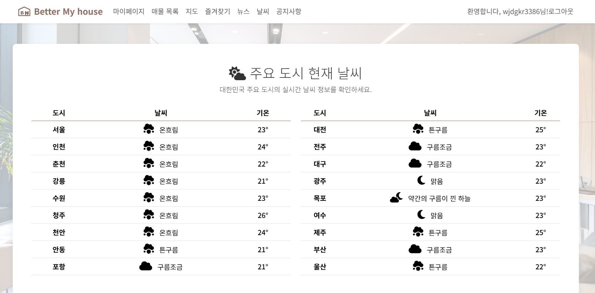
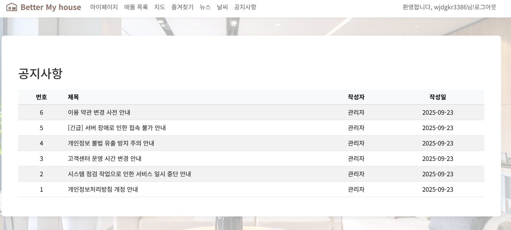

## 부동산 한눈에 보기
부동산 매물 관리 사이트

## 팀장 : 이민규
- 김기원, 김승식, 김태관, 김정학

## 기술 스택
- 프레임워크: Django
- 언어: Python, JavaScript, HTML, CSS
- DB: MySQL, SQLite3(개발)
- 라이브러리: Bootstrap
- 도구/개발환경: PyCham, Git/GitHub
- API: 날씨(OpenWeather), 지도(Kakao Maps), 뉴스(News API), 지오코딩(Geocoding API)

## 주요 기능
1. 매물 등록: 매물의 이름, 주소, 가격 등 데이터를 받아 저장합니다
2. 매물 목록: 등록된 매물을 꺼내 리스트에 보여주거나 지도에 마커를 찍어 보여줍니다

## 맡은 역할
- 여러 API 연동, 즐겨찾기, 매물 관리, 마이페이지 등

## 프로젝트 화면
 
 
 
 
 
 
 
 
 
 
 
 
 
 
 
 
 
 

## 문제점 및 해결방안
### 작품 개발 측면
BM부동산 웹 프로젝트는 총 5명의 팀원이 협업하며 진행되었습니다.
초기에는 각자 다른 개발 환경과 작업 방식을 사용해 Git Merge 과정에서 잦은 
충돌이 발생했습니다.  
특히, 로컬에서만 생성되는 .pyc, __pycache__ 파일들이 Git의 추적 대상이 되
어 병합 충돌의 주요 원인이 되었습니다. 이로 인해 코드 불일치와 작업 지연 
문제가 발생했습니다.
     
### 해결 방안
.gitignore 파일 도입하여 Git이 자동으로 생성되는 
파일(예: .pyc, __pycache__, .env)을 무시하도록 .gitignore 파일을 만들고
팀원 모두가 이를 공유했습니다. 
이를 통해 불필요한 파일로 인한 병합 충돌을 근본적으로 해결했습니다.

## 설치 코드 (가상환경에서)
pip install -r requirements.txt  
python manage.py makemigrations  
python manage.py migrate  
## 실행 코드 (가상환경에서)
python manage.py runserver
